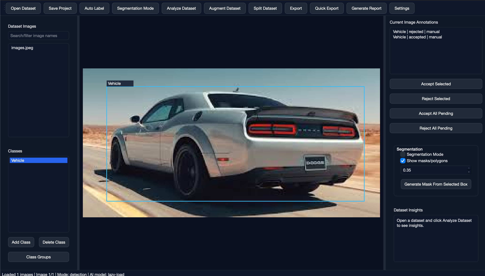

# VisionForge

**Offline-first AI-assisted annotation, segmentation, and dataset intelligence tool for Edge AI, ADAS, and computer vision datasets.**




---

## What is VisionForge?

**VisionForge** is a local desktop tool for preparing computer vision datasets for training, validation, and edge deployment.

LabelImg helps you draw boxes. **VisionForge helps you prepare datasets for training, validation, and edge deployment.**

It supports manual annotation, optional YOLO auto-labeling, optional SAM-compatible segmentation assistance, class grouping, dataset analysis, augmentation, train/val/test splitting, export, and report generation.

---

## Why VisionForge?

Most annotation tools focus on drawing labels. Real-world dataset work needs more than that.

VisionForge is designed for the complete dataset preparation workflow:

- Annotate images manually
- Auto-label using object detection models
- Generate segmentation masks from prompt boxes
- Review AI predictions before accepting them
- Manage and group classes for ADAS / Edge AI
- Analyze dataset quality and class balance
- Split datasets safely for training
- Export to training-ready formats
- Generate reports for dataset readiness

VisionForge is not meant to replace every platform. CVAT, Label Studio, Roboflow, and LabelImg are strong tools. VisionForge focuses on an **offline-first, developer-friendly workflow** for serious dataset preparation.

---

## Key Features

### Annotation

- Manual bounding-box annotation
- Select, move, resize, and delete boxes
- Class assignment and class management
- Auto-save project workflow
- Keyboard shortcuts for fast labeling
- Supports JPG, JPEG, PNG, BMP, and WEBP images

### AI-Assisted Labeling

- Optional YOLO auto-labeling
- Lazy dependency loading so the app works without heavy AI packages
- Confidence and IoU threshold settings
- Current-image and dataset-level auto-labeling flow
- AI prediction review status:
  - `pending`
  - `accepted`
  - `rejected`
  - `edited`

### Segmentation Workflow

- Optional SAM / SAM-compatible segmentation backend
- Generate masks from detection boxes
- Generate masks from manually drawn prompt boxes
- Convert segmentation masks to polygons
- Convert masks/polygons to bounding boxes
- Export COCO segmentation annotations

### Dataset Intelligence

- Total images and annotation count
- Annotated vs unannotated images
- Class-wise object count
- Annotation source breakdown
- AI review status breakdown
- Object size distribution
- Class imbalance detection
- Missing/broken file warnings
- Detection vs segmentation coverage

### ADAS / Edge AI Readiness

VisionForge includes a dataset readiness score out of 100 based on:

- Annotation coverage
- Class balance
- Object size diversity
- Small object coverage
- File health
- AI review completion
- Split quality
- Dataset scale
- Segmentation coverage

Example warnings:

- Pothole class is underrepresented
- Too many pending AI predictions
- Small object coverage is weak
- Train/val/test split is not class-balanced
- Possible video-frame leakage risk

### Dataset Tools

- Augmentation with bbox correction for supported transforms
- Dataset randomizer with filename mapping
- Train/val/test splitter
- Class-balanced split option
- Grouped class export for ADAS/embedded deployment

### Export Formats

- YOLO Detection TXT
- Pascal VOC XML
- COCO Detection JSON
- COCO Segmentation JSON
- CSV Summary
- Grouped Class Export

---

## Screenshots


More screenshots and GIFs will be added as the project evolves.

---

## Installation

### 1. Clone the repository

```bash
git clone https://github.com/samwin27-sudo/VisionForge.git
cd VisionForge
```

### 2. Create a virtual environment

macOS / Linux:

```bash
python3 -m venv .venv
source .venv/bin/activate
```

Windows:

```bash
python -m venv .venv
.venv\Scripts\activate
```

### 3. Install basic dependencies

```bash
pip install --upgrade pip
pip install -r requirements.txt
```

### 4. Run VisionForge

```bash
python run.py
```

---

## Optional AI Installation

VisionForge works without AI dependencies. Manual annotation does not require YOLO, SAM, or PyTorch.

Install AI features only when needed.

### YOLO auto-labeling

```bash
pip install -r requirements-ai.txt
```

Download a small YOLO test model:

```bash
python scripts/download_yolo_models.py --model yolov8n.pt
```

Then load the model from:

```text
models/yolo/yolov8n.pt
```

### SAM segmentation

```bash
pip install -r requirements-segmentation.txt
```

Read the SAM download guide:

```text
scripts/download_sam_models.md
```

Recommended first checkpoint:

```text
sam_vit_b_01ec64.pth
```

Place it inside:

```text
models/sam/
```

---

## Model Weight Policy

VisionForge does **not** ship pretrained model weights inside the repository.

This keeps the repository lightweight and avoids redistributing third-party model files.

Local model files should be placed inside:

```text
models/
  yolo/
    yolov8n.pt
    your_custom_model.pt

  sam/
    sam_vit_b_01ec64.pth
```

The `.gitignore` is configured to prevent accidental commits of large model files such as:

```text
*.pt
*.pth
*.onnx
*.tflite
*.ckpt
*.safetensors
```

---


## VisionForge v1.1.0 Highlights

- Batch auto-annotation for the full dataset
- Single-image auto-annotation and full-dataset auto-annotation use the same settings dialog
- Editable COCO/ADAS class mapping, for example `Vehicle = car, truck, bus, train`
- Optional YOLO + SAM workflow to generate segmentation polygons from detected boxes
- Remember default YOLO and SAM models until the user changes them
- Class-colored bounding boxes for easier review
- More standard augmentation options: grayscale, contrast, saturation, blur, noise, sharpen, vertical flip, random crop, resize, and small-angle rotation


## Quick Start

1. Run the app:

   ```bash
   python run.py
   ```

2. Click **Open Dataset** and select an image folder.

3. Add or import classes.

4. Draw bounding boxes manually.

5. Optional: run YOLO auto-labeling.

6. Review AI predictions before exporting.

7. Analyze the dataset.

8. Export labels in YOLO, VOC, COCO, or CSV format.

9. Generate a dataset report.

---

## Keyboard Shortcuts

| Shortcut | Action |
|---|---|
| `A` / `Left Arrow` | Previous image |
| `D` / `Right Arrow` | Next image |
| `Delete` / `Backspace` | Delete selected annotation |
| `Ctrl + S` | Save project |
| `Ctrl + O` | Open dataset |
| `Ctrl + E` | Export |
| `Ctrl + Shift + E` | Quick export using last export settings |
| `Ctrl + R` | Generate report |
| `Ctrl + A` | Auto-label current image |
| `Ctrl + Shift + A` | Auto-label full dataset |
| `Ctrl + M` | Toggle segmentation visibility |
| `Ctrl + G` | Open class grouping manager |
| `Space` | Accept current AI prediction |
| `X` | Reject current AI prediction |

---

## Internal Project Format

VisionForge stores project metadata in:

```text
visionforge_project.json
```

It tracks:

- Dataset path
- Classes and colors
- Class groups
- Image metadata
- Bounding boxes
- Segmentation polygons/masks
- AI confidence scores
- Annotation source
- Review status
- Export settings

---

## Class Grouping for ADAS / Edge AI

VisionForge supports grouping raw classes into deployment-friendly categories.

Example:

```text
car + bus + truck          -> Vehicle
motorcycle + bicycle      -> Bike
person                    -> Pedestrian
pothole                   -> Road Damage
speedbreaker              -> Road Feature
traffic_light + sign      -> Road Signage
```

Export options:

- Original classes
- Grouped classes
- Both original and grouped outputs

---

## Reports

VisionForge can generate:

```text
dataset_report.html
dataset_summary.xlsx
class_distribution.csv
image_annotation_summary.csv
readiness_score.json
warnings_and_recommendations.txt
```

Reports include:

- Dataset summary
- Class distribution
- Annotation status breakdown
- Object size distribution
- Readiness score
- Warnings and recommendations
- Export and split summaries

---

## Project Structure

```text
VisionForge/
  run.py
  requirements.txt
  requirements-ai.txt
  requirements-segmentation.txt
  requirements-dev.txt
  README.md
  LICENSE

  visionforge/
    ui/
    core/
    ai/
    exporters/
    importers/
    analysis/
    augment/
    split/
    randomizer/

  models/
    README.md

  scripts/
    download_yolo_models.py
    download_sam_models.md

  docs/
  examples/
  tests/
```

---

## Development

Install development dependencies:

```bash
pip install -r requirements-dev.txt
```

Run tests:

```bash
PYTHONPATH=. pytest -q
```

Compile check:

```bash
python -m compileall -q visionforge tests
```

---

## Roadmap

Planned improvements:

- Better polygon editing tools
- More segmentation backends
- SAM2 support
- ONNX/TFLite model preview support
- Dataset versioning
- Video frame sequence-aware splitting
- More augmentation controls
- COCO panoptic export
- Plugin system for custom model backends
- Better Mac/Windows packaging
- Demo GIFs and sample datasets

---

## Known v1 Limitations

VisionForge is an early public release.

Current limitations:

- Segmentation workflow is modular but still improving in the UI
- SAM checkpoint selection is currently documented more than fully automated
- Polygon editing tools are basic
- Large dataset performance needs more stress testing
- AI auto-labeling quality depends on the model used
- Production ADAS validation still requires separate testing and verification

---

## Contributing

Contributions are welcome.

Useful areas:

- UI polish
- Segmentation workflow improvements
- Exporter validation
- Dataset analysis metrics
- Testing with larger datasets
- Documentation and screenshots
- Packaging for macOS / Windows / Linux

Before opening a pull request, please run:

```bash
python -m compileall -q visionforge tests
PYTHONPATH=. pytest -q
```

---

## License

MIT License.

See [LICENSE](LICENSE).

---

## Disclaimer

VisionForge helps prepare datasets. It does not guarantee model accuracy, regulatory compliance, or ADAS production safety.

Always validate datasets, models, and deployment behavior before using them in real-world or safety-critical systems.
